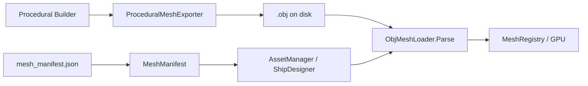

# 3D Model File Migration Plan

> **Goal:** Replace runtime procedural mesh generation with organized Wavefront `.obj` assets, per-race folder layout, manifest-driven loading, and Ship Designer integration.

**Status:** In progress — see [`MODEL_MIGRATION_PROGRESS.md`](MODEL_MIGRATION_PROGRESS.md) for live counts.

---

## Problem

Ships, stations, planets, and effects are built procedurally in C# (`RaceShipMeshes`, `RaceStationMeshes`, `ProceduralMeshes`). JSON definitions reference mesh keys like `meshes/fighter_basic.obj`, but those files do not exist — `RegisterProceduralMesh()` bypasses disk lookup.

This blocks:

- Artist-authored replacement models
- External tooling (Blender, etc.)
- Ship Designer preview without the full game loop
- CI validation that assets exist on disk

---

## Target Asset Layout

```
GameData/Meshes/
├── Ships/
│   └── {race}/                    # terran, vesper, korath, …
│       └── {definition_id}.obj    # fighter_basic, destroyer_assault, …
├── Designs/
│   └── {race}/
│       └── {design_id}.obj        # terran_fighter_mk1_00, … (500 catalog entries)
├── Stations/
│   └── {race}/
│       └── {station_id}.obj       # command_center, shipyard_large, …
├── Environment/
│   ├── planets/
│   │   ├── neutral_planet.obj
│   │   └── harvestable_planet.obj
│   └── scenery/
│       ├── asteroid_field.obj
│       ├── nebula.obj
│       └── debris.obj
├── Projectiles/
│   ├── laser.obj
│   ├── beam.obj
│   ├── torpedo.obj
│   ├── missile.obj
│   ├── bomb.obj
│   ├── cannon.obj
│   └── wave.obj
├── Effects/
│   ├── selection_ring.obj
│   ├── engine_trail.obj
│   ├── move_target.obj
│   ├── team_aura_disc.obj
│   ├── resource_node.obj
│   ├── mining_drone.obj
│   └── eva_astronaut.obj
├── Units/
│   └── drone_worker.obj
└── Shared/
    ├── default_ship.obj
    ├── default_base.obj
    └── default_projectile.obj
```

**Naming convention:** `{category}/{race}/{id}.obj` — lowercase, underscores, matches `EntityDefinition.Id` or `ShipDesignSpec.DesignId`.

---

## Manifest (`GameData/Config/mesh_manifest.json`)

Central registry mapping logical keys to files:

| Field | Purpose |
|-------|---------|
| `key` | Lookup string (e.g. `meshes/ships/terran/fighter_basic.obj`) |
| `category` | ship \| design \| station \| environment \| projectile \| effect \| shared |
| `raceId` | Faction (nullable for shared/env) |
| `modelId` | Hull / station / effect id |
| `displayName` | Human label for Ship Designer |
| `relativePath` | Path under `GameData/Meshes/` |

`MeshManifest.Resolve(raceId, modelId, category)` returns the canonical key.

---

## Pipeline



### Phase 1 — Infrastructure (PR 1)

- `ProceduralMeshExporter` — procedural `float[]` (stride 6, pos+color) → Wavefront OBJ with computed normals
- `MeshManifest` — load/lookup manifest entries
- `ModelMigrationExporter` — batch export all catalogued models
- Extend `AssetManager.ResolveMeshPath` for nested paths + manifest override
- `docs/MODEL_MIGRATION_PROGRESS.md` — live tracker

### Phase 2 — Asset Export (PR 2)

Sub-agent batches (one race per agent):

1. Export 19 ships × 1 race → `Meshes/Ships/{race}/`
2. Export 10 stations × 1 race → `Meshes/Stations/{race}/`
3. Export 62–63 designs × 1 race → `Meshes/Designs/{race}/`
4. Export environment / projectiles / effects (shared batch)
5. Update progress markdown after each batch

**Initial export source:** existing procedural builders (visual parity). Artists can replace `.obj` files later without code changes.

### Phase 3 — Loader Integration (PR 3)

- `MeshAssetService` — try OBJ on disk first, fall back to procedural
- `EngineWindow.RaceMeshes` — load from manifest path instead of `RaceShipMeshes.BuildDesign` when file exists
- `BrowserMeshLibrary` — same path for WASM
- Remove `RegisterProceduralMesh` stubs once all keys resolve to real files

### Phase 4 — Ship Designer (PR 4)

- `ShipDesignerScreen` — race picker + hull list from `MeshManifest`
- `ShipDesignerRenderer` — resolve `meshes/ships/{race}/{shipId}.obj` via manifest
- `ShowShipDesigner` — wire `MeshRegistry` + `MeshAssetService`
- Preview uses `ObjMeshData` (normals) instead of color-vertex procedural

### Phase 5 — Proof Loop (PR 5)

Sub-agent verification batches:

- Every manifest entry: file exists, `ObjMeshLoader.Parse` succeeds, vertex count ≥ threshold
- Round-trip: exported OBJ matches procedural vertex count (± welding tolerance)
- `RaceSubstrateCatalogTests` — load from disk
- `dotnet test` full suite green

---

## Model Inventory

| Category | Count | Source |
|----------|------:|--------|
| Ships (race × hull) | 152 | 8 races × 19 `FleetGalleryLayout.AllShipIds` |
| Ship designs (full catalog) | 500 | `ShipDesignCatalog.TotalDesigns` |
| Stations (race × base) | 128 | 8 races × 16 `FleetGalleryLayout.AllBaseIds` |
| Environment | 5 | planets + scenery types |
| Projectiles | 7 | weapon visual types |
| Effects | 7 | HUD / mining / selection |
| Units | 1 | `drone_worker` |
| Shared fallbacks | 3 | default ship/base/projectile |
| **Total** | **755** | |

---

## Key Decisions

| Decision | Rationale |
|----------|-----------|
| **Wavefront .obj** | `ObjMeshLoader` already exists; no new deps; Git-friendly text |
| **Export from procedural first** | Preserves current visuals; unblocks pipeline before art pass |
| **Nested race folders** | User requirement; matches Fleet Gallery zones |
| **Manifest JSON** | Ship Designer + loaders share one source of truth |
| **Procedural fallback** | Safe rollout; remove once proof loop passes |
| **pos+normal stride for loaded meshes** | `ObjMeshData` layout; materials/tints via shader, not vertex color |

---

## Sub-Agent Execution Strategy

| Batch | Agent scope | Models |
|-------|-------------|--------|
| Race 0–7 | One agent per race | ~91 (19 ships + 10 stations + ~62 designs) |
| Environment | 1 agent | 5 |
| Projectiles + Effects | 1 agent | 14 |
| Units + Shared | 1 agent | 4 |
| Proof | 8 agents (race shards) | Validate + test per shard |

Progress file updated after each batch completes.

---

## PR Plan

### PR 1 — Infrastructure
- `ProceduralMeshExporter.cs`, `MeshManifest.cs`, `ModelMigrationExporter.cs`
- `GameData/Config/mesh_manifest.json` (generated)
- `docs/MODEL_MIGRATION_PLAN.md`, `docs/MODEL_MIGRATION_PROGRESS.md`
- Tests: `ProceduralMeshExporterTests`, `MeshManifestTests`

### PR 2 — Asset export (755 .obj files)
- `GameData/Meshes/**` tree populated
- Progress tracker → 100%

### PR 3 — Loader integration
- `MeshAssetService.cs`, `AssetManager` nested paths
- `EngineWindow.RaceMeshes.cs`, `BrowserMeshLibrary.cs`
- Deprecate procedural-only path

### PR 4 — Ship Designer wiring
- `ShipDesignerScreen` race/hull picker
- `EngineWindow.Gameplay.ShowShipDesigner` uses `MeshRegistry` + manifest

### PR 5 — Proof + cleanup
- `ModelMigrationProofTests`
- Update `AGENTS.md`, entity JSON `mesh` keys to race-aware paths where needed

---

## Open Questions

1. **glTF later?** OBJ is sufficient for v1; manifest `format` field can add `gltf` without breaking keys.
2. **500 designs vs 152 hulls in gameplay?** Gameplay keeps `ShipDesignCatalog.Resolve()`; designer exposes full 500 via `Designs/` folder.